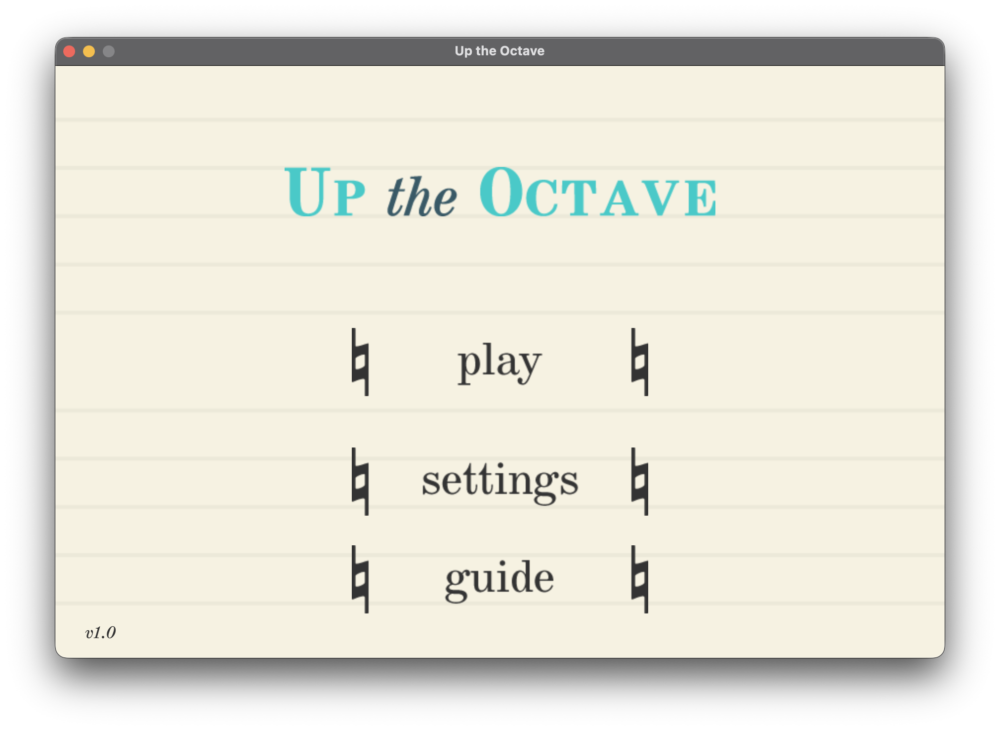
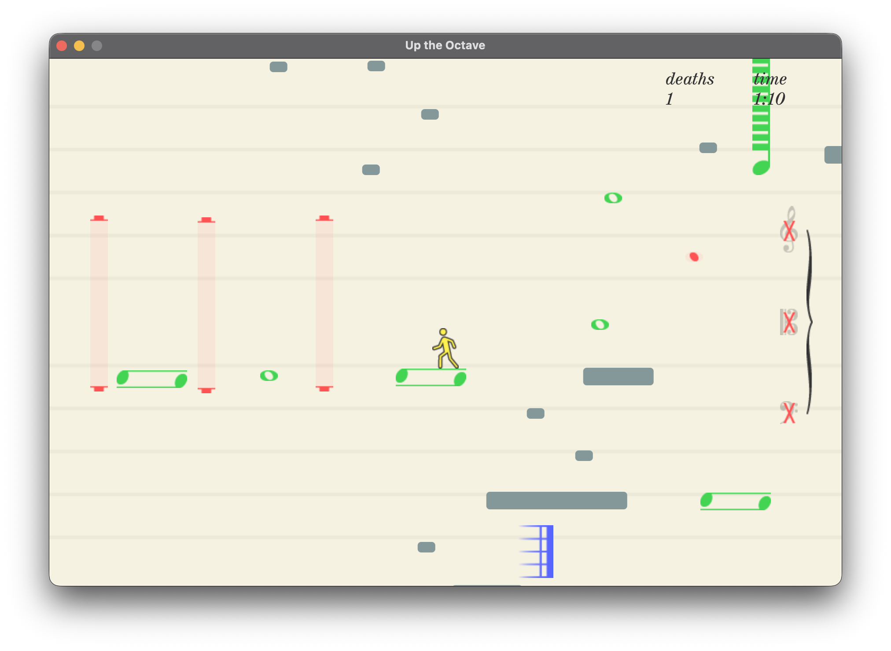
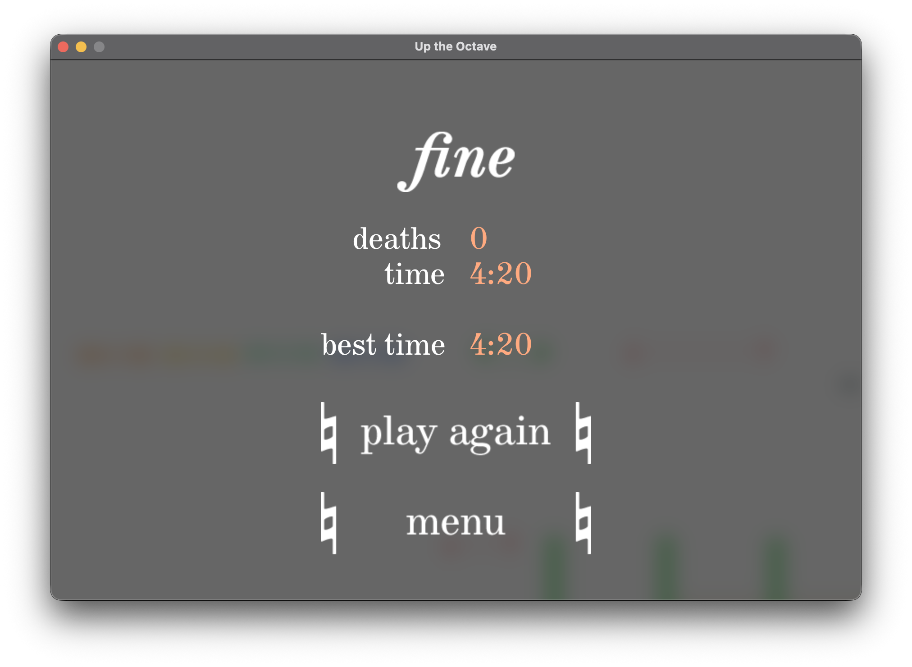

# Up the Octave

A group game assignment project for the ICS4U class.

## Credits

*Up the Octave* was made in collaboration with [Crowvic](https://github.com/Crowvic) and [SpaceCat321](https://github.com/SpaceCat321).

Music - excerpts from *Boléro*, M.81 by Maurice Ravel

## Screenshots

